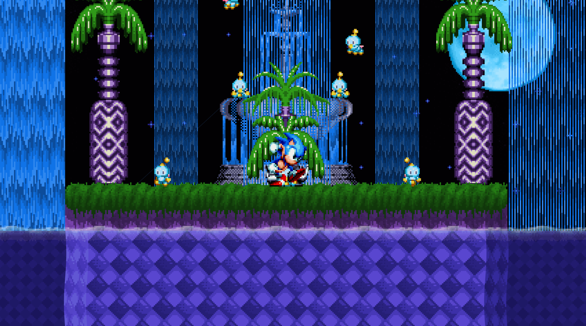

# Quill Framework
<p align="center">
  
</p>

Quill Framework is a feature-rich classic Sonic-inspired 2D framework for the Unity Engine. This framework originally started off as a fun sandbox project for me to learn how to program in C#. Like any sandbox-type project, I didn't have an end goal in mind, but I think where it is right now is the perfect starting point for other people.

The main focus of this framework was to keep things as "Unity" as possible while being as close to Sonic as I could vision. This means if you understand a bit of Unity stuff like the Animator system, 2D colliders, and all that good Unity stuff, this project will be less foreign to you.

## 🚀 Key Features
- Classic Sonic 360-styled physics in a way familiar to Unity
- 4 Playable sonic characters with unique abilities
- A special click-and-drop editor for those who just want to make their own levels
- Uncapped Speeds, you can make Sonic and his friends go as fast as you want to go with no restrictions
- Half-pipe special stages with a completely different foundation
- Parallax Scrolling
- Multiple Familiar Badniks
- Player Hazards
- Underwater Physics
- Multiple shields and shield abilities
- A Debug Mode that lets you manipulate the world in real-time
- Multiple Save Slots and a No save slot if that's what you're into
- Multiple Acts to play around with
- Cutscenes at the start and end of Acts
- Pad and Keyboard support
- Mult-platform support
- And Many More!

## ℹ️ Prerequisites
- Install [Unity 2021.3.8f](https://unity.com/releases/editor/whats-new/2021.3.8)
- Install [Git(Windows)](https://git-scm.com/download/win)

## 🎮 Controls 
```
These gamepad controls assume the user is using a controller that follows the Xbox control scheme

```

### Default Control Scheme
| Action | Keyboard | Gamepad |
| :---         |     :---:      |         :---:  |
| Jump  |||
| Transform     |       ||
| Pause     |      | |


### Debug Control Scheme
| Action | Keyboard | Gamepad |
| :---         |     :---:      |          :---:   |
| Jump  |||
| Transform     |||
| Debug Ring Mode     |||
| Pause  |||
| Moon Jump     |||
| Palette Swap     |||
| Toggle Debug UI |||
| Swap Character    |||
| All Emeralds     |||
| Grant Regular Shield  |||
| Grant Bubble Shield     |||
| Grant Electric Shield     |||
| Grant Flame Shield  |||
| Grant Invincibility    |||
| Grant Speed Shoes     |||

## 🌟 Abilities

### Sonic
- While Sonic has no shield holding down the Jump button in the air will trigger the drop dash
- With Shield active, hitting the Jump button causes different actions based on the Shield active
  - Flame Shield: This will cause Sonic to dash forward.
  - Bubble Shield: This will cause Sonic to move his velocity towards the ground and bounce off the terrain.
  - Electric Shield: This Will grant Sonic an extra Jump.

### Tails
- Tails play similarly to Sonic except with no shield abilities or drop dash
- On the other hand, while in the air pressing the Jump button again will cause Tail's fly upwards as long as he has the stamina for it
- While flying Tail's Tails' have the ability to deflect bullets and destroy Badniks
- When underwater, Tails will swim instead of flying

### Knuckles
- While Knuckles is jumping, pressing down the Jump button again will cause Knuckles to glide
- When Knuckles is in his gliding state, if he runs into a wall, he will begin Climbing the wall upwards or downwards based on the Players input
- Knuckles can also change his direction at any point while Gliding by hitting the direction opposite to where he is currently Gliding
- Knuckles fists also have the ability to deflect bullets and destroy Badniks while gliding
- Knuckles also has the ability to smash through walls without having to roll into a ball

### Super Sonic
- Super Sonic is similar to Sonic, but he instead of shield abilities and drop dashes, in this form Sonic is giving access to the homing attack, which instantly moves Super Sonic in the direction of enemies or gimmicks
- If there are no targets, Super Sonic will simply dash forward in the direction he is facing

## 📬 Discord
If you have any questions you don't want to ask here or just need help, [Discord](https://discord.gg/mht9ys9xxZ) is always an option

## 📷 Media



## 📇 Credits

| Area             | People                                                                |
| ----------------- | ------------------------------------------------------------------ |
| Project Lead| DamiTheHuman|
| Special Thanks & Inspiration| Giometric, Triangly, Nihil (Nullspace), Lake Fepard|
| Sounds | Sega Sound Team, Yasuhisa Watanabe |
| Additional Programming | Giometric, DW, Damizean, Nihil(Nullspace), Azu, Lark SS, Team Orbinaut |
| Sprites | DamiTheHuman, Random Talking Brush, SonicDash57,DBurraki, AkumaTH, Darkness3313, Cyclone, AshuraMoon, Homingmissile333 |
| Beta Testers | Foxeh, Strix, ShadowMasterx5, Frenzy-Kun, MetalMadness2006|

## 📜 Terms of Use
- Please give Credit to everyone who has helped develop & inspire this framework. Without them, it would not be possible.
- Feel free to use this framework for your projects, but DO NOT commercialise anything "Sonic The Hedgehog" related.
