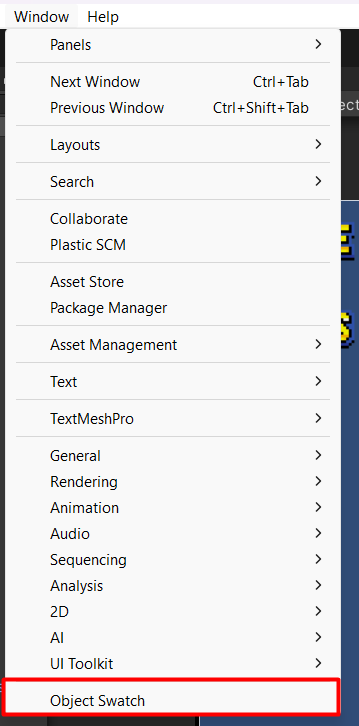

# Click & Drop Editor
## How To Open
To open the Object Swatch (Click & Drop Editor)
- Open the Quill Framework Unity Project
- In the Top Menu click the `Window` Button
- Amongst the options select `Object Swatch`

