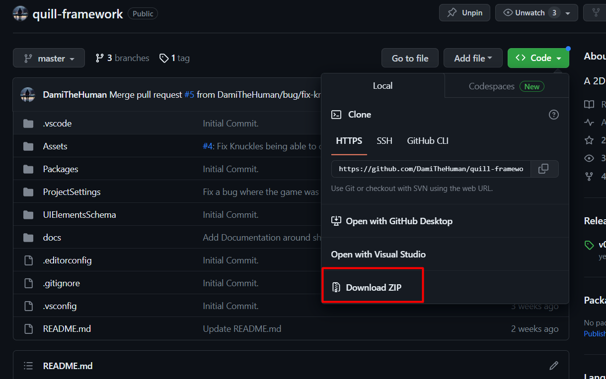
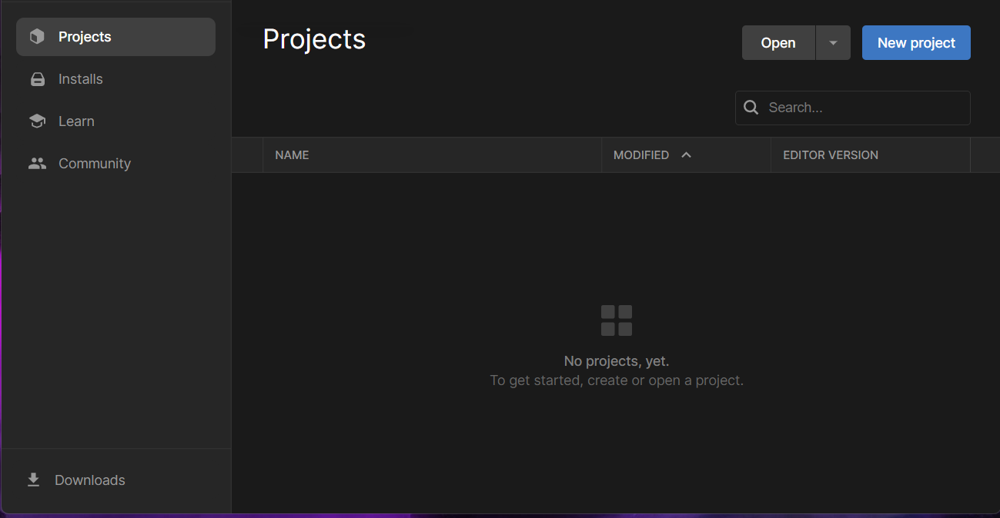
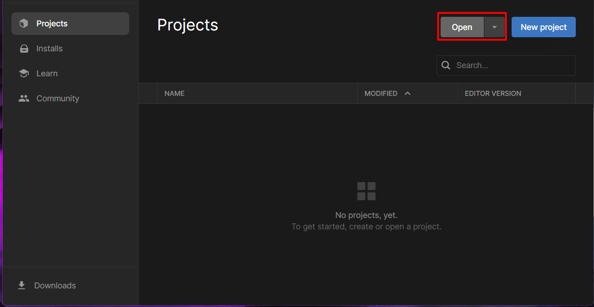

# Getting Started

## Prerequisites
To get started with the Quill Framework, you will need a couple of things, the Unity Hub, the Unity version for this project and Git
- [Unity Hub](https://unity.com/download)
- [Unity 2021.3.8f](https://unity.com/releases/editor/whats-new/2021.3.8)
- [Git(Windows)](https://git-scm.com/download/win)

```
You will need Unity to Open the application and Git for the application to use the packages it needs
```
## Downloading the Project
You can download the projects in two ways, downloading the .zip file directly from Github or cloning the  project with Git

### Zip Download
- Visit the Repository [Quill Framework](https://github.com/DamiTheHuman/quill-framework)
- In the top menu, click green`CODE` button
- Next, Choose the download `Download Zip` option

- Unpack the .zip file in the directory of your choice 

### Git Download (Recommended)
This is the recommended way to install this project
- With [Git](https://git-scm.com/download/win) installed 
- Open the terminal of your choice and run the following command

```bash
git clone https://github.com/DamiTheHuman/quill-framework.git
```

If you have never used Git before and want to learn, check this out [How to clone a Github Repository to your Local Machine](https://www.youtube.com/watch?v=EhxPBMQFCaI)

## Opening the Project

With the project on your local machine, [Unity Hub](https://unity.com/download) and [Unity 2021.3.8f](https://unity.com/releases/editor/whats-new/2021.3.8) installed
- Open the Unity Hub application. It should look like this

- Click the `Open` button

- Find the `quill-framework` project and click the `Open` Button
- If you do not have the appropriate Unity Version([Unity 2021.3.8f](https://unity.com/releases/editor/whats-new/2021.3.8)), please download it or things might not work as expected