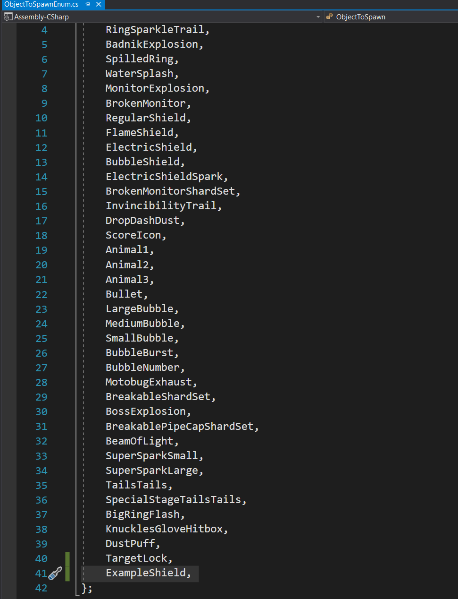

# Shields

- Shields are a staple power-up of the Sonic franchise, and in the Quill Framework, they work pretty similarly to how they would in their classic equivalent in-game. They can take a hit!

## Adding a Shield

### The script
-  Aside from the shield animations, which is up to the users themselves on how they want to implement this, to create a new shield, you must first create a relevant script for the Shield
- Here is an example script for an `Example Shield` that doesn't do much.

```csharp
/// <summary>
/// An example shield that can take a hit
/// </summary>
public class ExampleShield : HedgeShieldAbility
{

}
```

- A Shield has many events that you can subscribe to by extending the `HedgeShieldAbility` class. An excellent example of a shield using a lot of events is the [Flame Shield](Assets/Resources/Regular%20Stage/Elemental%20Shields/Flame%20Shield/Script/FlameShield.cs) script.

- Some Notable shield events include:

| Event  | Notes |
| ------------- | ------------- |
| OnInitializeShield  | When the player first gets a shield  |
| OnActivateAbility  | When the player performs a shield action (Sonic 
Exclusive) |
| OnAbilityEnd | When the Activated shield ability is over |

### Creating the Shield GameObject
- Once you have created the relevant `Script` for your new `Shield` it's time to create a [Game Object](https://docs.unity3d.com/ScriptReference/GameObject.html) that will run the scripts.
- For this example, we will be cloning the [Regular Shield](Assets/Resources/Regular%20Stage/Elemental%20Shields/Regular%20Shield/Prefab/Regular%20Shield.prefab) into a new `Example Shield` and changing it's Sprite to a Scaled Up Circle, Feel free to use whatever Sprite you like.
- It should look something like this:


> Tick the `Can Be Used UnderWater` checkbox to stop your Shield from being removed when Underwater!

## Registering Your New GameObject As A Shield
- After your Shield Game Object has been created, you will need to be able to register the Shield so that the game state can treat it as such
- To do this, Open up the [ShieldTypeEnum](/Assets/Resources/Regular%20Stage/Player/Enum/ShieldTypeEnum.cs) script and add an Entry for your Shield.


- For this guide, we added the `ExampleShield`

### Assigning the Shield as A Power-Up
- Next, we need to register the Shield as a Power Up. This is important so it can be assigned to Monitors.
- To begin this process, open up the [PowerUpEnum](/Assets/Other%20Resources/Managers/Enums/PowerUpEnum.cs) and register your `Shield` there. We have added the `ExampleShield`


- For this guide, we added the `ExampleShield`.

### Adding the Shield to the Game Pool
- For the player to have  access to the Shield during gameplay, we must inform our `Pool Manager` to create an instance of our `Example Shield` so that it can be referenced easily from anywhere
- First, we need to assign a `Tag` to our [Object To Spawn Enum](/Assets/Resources/Regular%20Stage/General/Spawnable%20Prefabs/Enum/ObjectToSpawnEnum.cs) List.



- For this guide, we added the `ExampleShield`.

- Now we can add the new Shield to the pool. To do this, open up the [Spawnable Prefabs Pool](/Assets/Resources/Regular%20Stage/General/Spawnable%20Prefabs/SpawnablePrefabsPool.asset). Click the `+` Sign and add the details of your new Shield for us. It would be the `Example Shield` for you. It might be different.
- It should look something like this:


- For this guide, we added the `Example Shield` object with the relevant `Prefab` and `Size`. 

### Handle the granting of the Shield
- Now that the Shield has been registered as a `Power Up`, `Shield` and added to our `Pool`, we must inform our [Grant Power Up Manager](Assets/Other%20Resources/Managers/Scripts/GMGrantPowerUpManager.cs) on what to do when they receive an event to grant the player the Shield we have created.
- Open the [Grant Power Up Manager](Assets/Other%20Resources/Managers/Scripts/GMGrantPowerUpManager.cs) script and scroll to the `GrantPowerUp` function.
- Like the other Power Ups, we need to tell the Power Up Manager what to do when it receives a power-up of this type.
> Most shields follow the same format, so you can just copy and paste from the previous one, but tweaking the `ObjectToSpawn` and the `ShieldType` to your needs.

```csharp
case PowerUp.ExampleShield:
  powerupGameObject = GMSpawnManager.Instance().SpawnGameObject(ObjectToSpawn.ExampleShield, player.transform.position);
  player.GetHedgePowerUpManager().GetShieldPowerUp().GrantShield(ShieldType.ExampleShield, powerupGameObject);

break;
```

> In the script above, we get an instance of our Shield from the Pool and then attach it to the player who requested the Shield.

### Granting the Shield
- Now that we have fully configured our Shields and all the parts that need to know about the Shields' existence are aware, we can now grant the Player the Shield via how Most Sonic games do: Monitors.
- For this example, we are going to make use of the [Base Monitor](/Assets/Resources/Regular%20Stage/Monitors/Regular%20Monitors/Monitor%20-%20Base.prefab) Game Object and set it to grant our `Example Shield`
- Drag and drop the [Base Monitor](/Assets/Resources/Regular%20Stage/Monitors/Regular%20Monitors/Monitor%20-%20Base.prefab) Prefab and set the `Power Up To Grant` to `Example Shield`.
- Once the [Base Monitor](/Assets/Resources/Regular%20Stage/Monitors/Regular%20Monitors/Monitor%20-%20Base.prefab) has been broken, you will be granted your new Shield! Hopefully, your Shield looks better than mine!


